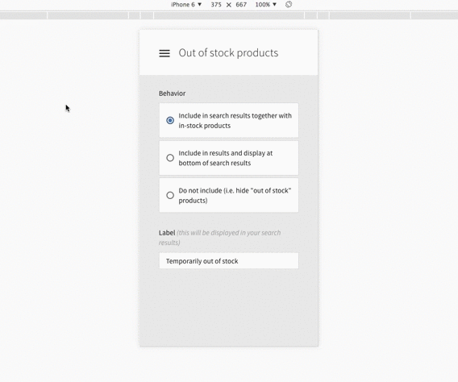

# AngularJS Admin Dashboard
The beginnings of a responsive AngularJS Admin Dashboard utilizing Bootstrap and Material components.

### Demo
Try it out via this link on your mobile or desktop: http://lewhunt.github.io/angularjs-admin-dashboard

### Notes
This example is primarily for learning purposes and requires further customization. It is not yet intended as a complete drop-in solution.

The sidebar menu currently makes use of the standard bootstrap accordion instead of Angular's UI accordion, because of improved animation performance.
